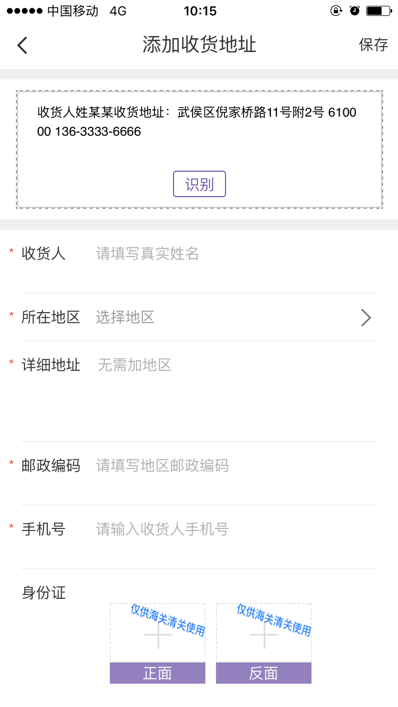
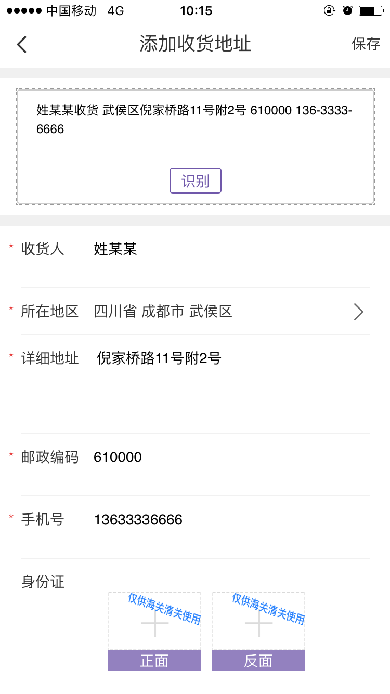

# 收货地址智能解析
````
内含2个功能
1.  把字符串解析成姓名、收货电话、邮编、收货地址
2. 把收货地址解析成省、市、区县、街道小区地址
````
在代购业务中，会经常遇到，客户把收货信息（包含姓名，电话，收货地址的字符串，往往还不会分开，会连在一起）发给代购，代购再到采购平台下单，但是代购会把姓名，收货地址这些信息分开复制，工作量会比较大。本项目正是可以实现收货地址信息的智能解析，让代理解双手，让代理爱上采购平台。

该项目采用的是，统计特征分析，然后以最大的概率来匹配，得出大概率的解。因此只能解析中文的收货信息，而且不能保证100%解析成功，但是从生产环境的使用情况来看，解析成功率保持在96%以上。




如果有什么问题或建议，可以
提交[Github Issue](https://github.com/pupuk/address-smart-parse/issues)

## 关于如何加入
如果有更好的思路，或者优化建议，可以：

1. fork该项目
1. 提交Pull Requests
1. 如果积极贡献，可以放开权限

## 1. 把字符串解析成姓名、收货电话、邮编、收货地址
使用parse_prepare.php文件中的Address::smart_parse方法，该静态方法接受字符串，返回数组。如：

```php
Address::smart_parse('收货人姓某某收货地址：武侯区倪家桥路11号附2号  617000  136-3333-6666 ');
```

返回：
```php
array(4) {
  ["name"]=> "姓某某"
  ["mobile"]=> "13633336666"
  ["postcode"]=>"617000"
  ["detail"]=>"武侯区倪家桥路11号附2号"
}
```


## 2. 把收货地址解析成省、市、区县、街道小区地址
使用parse_detail.php文件中的$obj = AddressDetail::detail_parse($str)方法，该静态方法接受字符串，同样返回数组。但该文件要配合项目的的地址库 area.sql 才能使用，如：
```php
AddressDetail::detail_parse('成都市高新区天府软件园B区科技大楼');
```

返回数组
```php
array(3) {
  [1]=>
  array(2) {
    ["area_id"]=>
    23
    ["area_name"]=>
    "四川省"
  }
  [2]=>
  array(2) {
    ["area_id"]=>
    385
    ["area_name"]=>
    "成都市"
  }
  [3]=>
  array(2) {
    ["area_id"]=>
    5100
    ["area_name"]=>
    "高新区"
  }
}
```


## 3. 联系作者
* Email：pujiexuan@gmail.com
